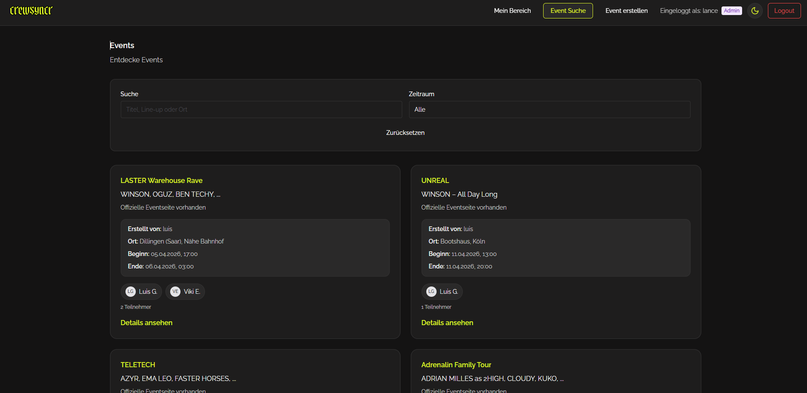
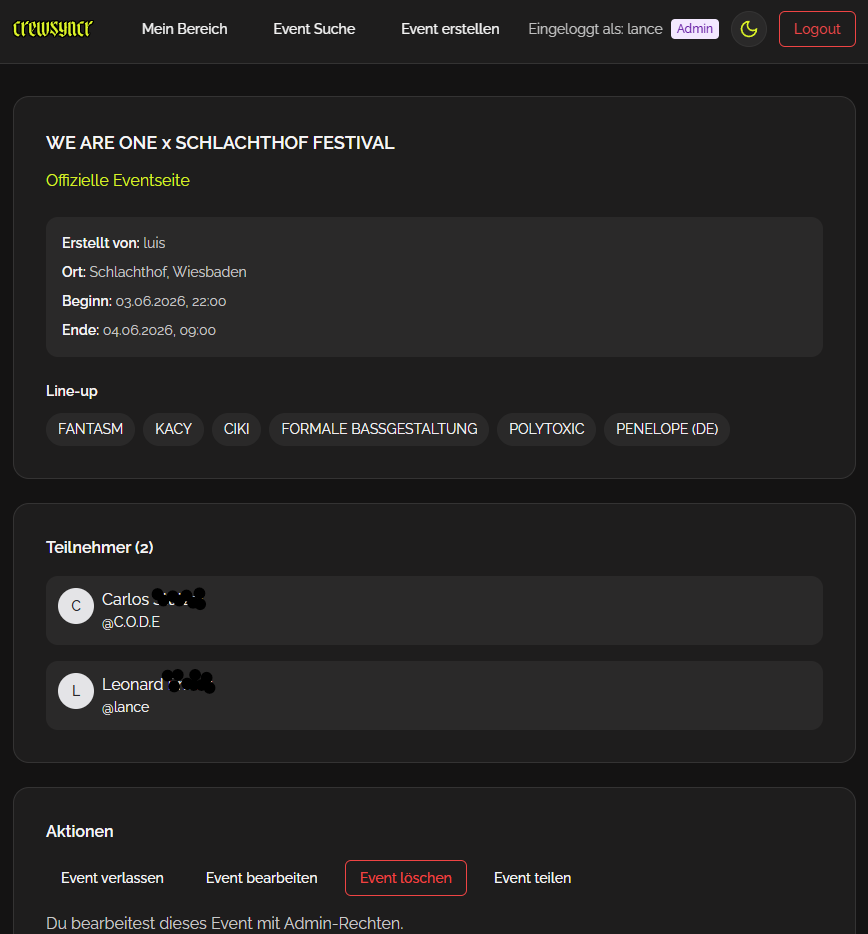
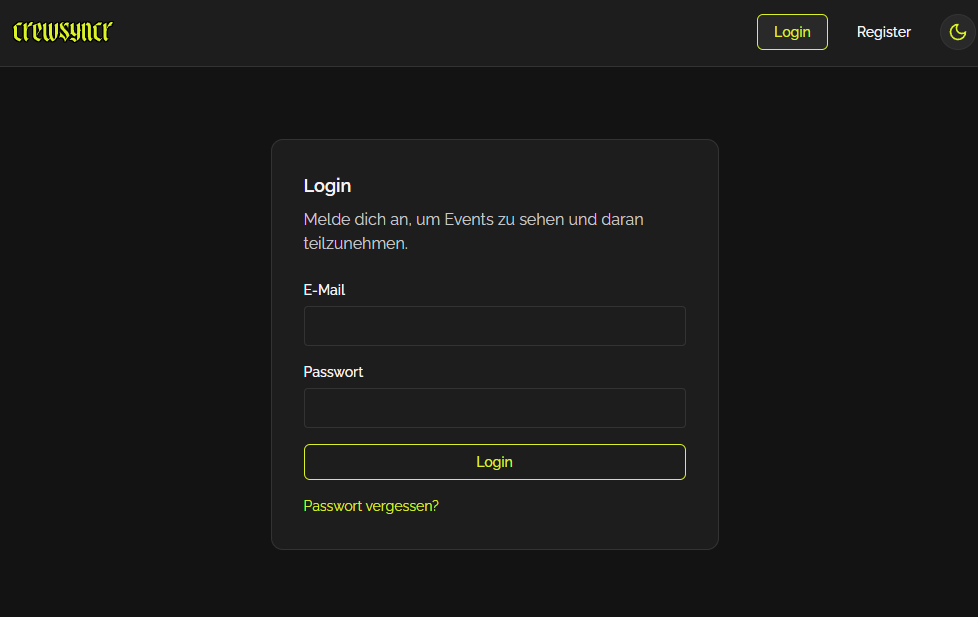

# 🎧 CrewSyncr — Plattform für Musik-Events

Eine moderne Webanwendung zur Organisation und Teilnahme an Musik-Events.

---

## 🚀 Überblick

CrewSyncr ermöglicht es Nutzern, Musik-Events zu erstellen, zu entdecken und daran teilzunehmen.
Der Fokus liegt auf einem klar strukturierten MVP mit sauberer Architektur und Erweiterbarkeit.

---

## ✨ Funktionen

- Registrierung und Login
- Authentifizierung via JWT (HttpOnly-Cookies)
- Events erstellen, durchsuchen und verwalten
- Join / Leave Funktion für Events
- Nutzerprofile und Teilnehmerübersicht
- Responsives, modernes UI

---

## 🧱 Tech Stack

### Frontend

- React
- TypeScript
- Vite
- Chakra UI

### Backend

- FastAPI
- Python

### Datenbank

- PostgreSQL
- SQLAlchemy
- Alembic (Migrationen)

---

## 🧠 Architektur

```text
Frontend (React)
   ↓
API (FastAPI)
   ↓
PostgreSQL
```

- Klare Trennung von UI, Logik und Datenhaltung
- Sicherheitskritische Logik im Backend
- Modularer Monolith für schnelles MVP

---

## 🔐 Sicherheit

- JWT-Authentifizierung über HttpOnly-Cookies
- Sichere Cookie-Konfiguration (`secure`, `SameSite`)
- Backend-basierte Zugriffskontrolle
- Vorbereitung für CSRF-Schutz

---

## 🌐 Demo

> ⚠️ Die Anwendung ist aktuell durch ein Master-Passwort geschützt (Entwicklungsphase).

Um dennoch einen Eindruck zu vermitteln, sind unten Screenshots eingebunden 👇

---

## 📸 Screenshots

> Hier eigene Screenshots einfügen

### 🗂 Event Übersicht



### 🎵 Event Detail



### 🔐 Login / Registrierung



---

## ⚙️ Lokales Setup

### Voraussetzungen

- Node.js & npm
- Python 3.10+
- PostgreSQL

---

### 1. Repository klonen

```bash
git clone https://github.com/DEIN_USERNAME/crewsyncr.git
cd crewsyncr
```

---

### 2. Backend starten

```bash
cd backend

python -m venv .venv
source .venv/bin/activate

pip install -r requirements.txt
alembic upgrade head

uvicorn app.main:app --reload
```

---

### 3. Frontend starten

```bash
cd frontend

npm install
npm run dev
```

---

## 🚀 Deployment

- VPS (Ubuntu Server)
- Nginx als Reverse Proxy
- systemd für Prozessmanagement
- HTTPS via Let's Encrypt
- Subdomain für API (`api.*`)

---

## 🧪 API Dokumentation

FastAPI stellt automatisch eine API-Dokumentation bereit:

```text
http://localhost:8000/docs
```

---

## 📌 Projektstatus

- Kernfunktionen implementiert ✔
- Backend & Datenbank stabil ✔
- Deployment eingerichtet ✔
- Sicherheits- und Produktionsoptimierung in Arbeit ⚠️

---

## 🔮 Nächste Schritte

- Vollständiger CSRF-Schutz
- Admin-Funktionalitäten
- Erweiterte Event-Suche / Filter
- Benachrichtigungssystem
- CI/CD Pipeline

---

## 👨‍💻 Entwickler

**Dein Name**

- GitHub: https://github.com/DEIN_USERNAME
- LinkedIn: (optional)

---

## 📄 Lizenz

MIT License
